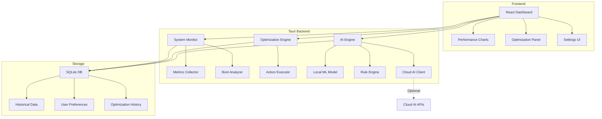

# Smart System Optimization Dashboard - Technical Plan

## Project Overview

A cross-platform desktop application built with Tauri and React that provides AI-powered system optimization suggestions to improve boot time and overall performance. The application uses a hybrid AI approach combining local ML models for privacy-focused basic analysis with optional cloud AI integration for advanced insights.

## Technology Stack

### Frontend
- **Framework**: React 18+ with TypeScript
- **UI Library**: Tailwind CSS + shadcn/ui components
- **State Management**: Zustand or Redux Toolkit
- **Charts**: Recharts or Chart.js for performance visualization
- **Icons**: Lucide React

### Backend
- **Runtime**: Tauri 2.x (Rust-based)
- **System Monitoring**: 
  - `sysinfo` crate for cross-platform system metrics
  - `windows-rs` for Windows-specific features
  - `core-foundation` for macOS-specific features
- **Data Storage**: SQLite via `rusqlite` for historical data
- **ML Integration**: `ort` (ONNX Runtime) for local ML models

### AI Components
- **Local ML**: ONNX models for pattern detection
- **Rule Engine**: Custom Rust-based heuristics
- **Cloud AI** (Optional): OpenAI/Anthropic API integration

## Core Features

### 1. System Monitoring Dashboard
- Real-time CPU, memory, disk, and network usage
- Process list with resource consumption
- Temperature monitoring (where available)
- Boot time tracking and history

### 2. Boot Time Optimization
- Startup program analysis
- Boot sequence visualization
- Impact scoring for each startup item
- One-click disable/enable for startup programs

### 3. AI-Powered Recommendations
- **Local Analysis**:
  - Pattern detection in resource usage
  - Anomaly detection for performance issues
  - Startup program impact prediction
  - Disk space optimization suggestions
  
- **Cloud Analysis** (Optional):
  - Deep system configuration analysis
  - Personalized optimization strategies
  - Comparative benchmarking
  - Advanced troubleshooting

### 4. Optimization Actions
- Disable/enable startup programs
- Clear temporary files and caches
- Optimize disk usage
- Manage background services
- Update outdated drivers (suggestions)

### 5. Performance Tracking
- Historical performance graphs
- Before/after optimization comparisons
- Boot time trends
- Resource usage patterns

### 6. User Settings
- AI preference configuration
- Notification preferences
- Auto-optimization rules
- Privacy settings (data collection opt-in/out)

## Architecture



## Project Structure

```
system-optimizer/
├── src-tauri/              # Rust backend
│   ├── src/
│   │   ├── main.rs         # Entry point
│   │   ├── system/         # System monitoring modules
│   │   │   ├── metrics.rs
│   │   │   ├── boot.rs
│   │   │   └── processes.rs
│   │   ├── optimization/   # Optimization engine
│   │   │   ├── analyzer.rs
│   │   │   ├── actions.rs
│   │   │   └── rules.rs
│   │   ├── ai/             # AI components
│   │   │   ├── local_ml.rs
│   │   │   ├── cloud.rs
│   │   │   └── recommendations.rs
│   │   ├── storage/        # Database layer
│   │   │   └── db.rs
│   │   └── commands.rs     # Tauri commands
│   ├── Cargo.toml
│   └── tauri.conf.json
├── src/                    # React frontend
│   ├── components/
│   │   ├── Dashboard.tsx
│   │   ├── PerformanceChart.tsx
│   │   ├── OptimizationPanel.tsx
│   │   ├── BootAnalysis.tsx
│   │   └── Settings.tsx
│   ├── hooks/
│   │   ├── useSystemMetrics.ts
│   │   └── useOptimizations.ts
│   ├── services/
│   │   └── tauri.ts        # Tauri API wrapper
│   ├── types/
│   │   └── index.ts
│   ├── App.tsx
│   └── main.tsx
├── models/                 # ML models
│   └── optimization_model.onnx
├── package.json
└── README.md
```

## Implementation Phases

### Phase 1: Foundation (Weeks 1-2)
- Set up Tauri + React project structure
- Implement basic system metrics collection
- Create dashboard UI skeleton
- Set up SQLite database schema

### Phase 2: Core Monitoring (Weeks 3-4)
- Implement real-time performance monitoring
- Build boot time analysis for both platforms
- Create performance visualization charts
- Add process management UI

### Phase 3: Rule-Based Optimization (Weeks 5-6)
- Develop rule-based recommendation engine
- Implement common optimization actions
- Create optimization panel UI
- Add historical tracking

### Phase 4: Local ML Integration (Weeks 7-8)
- Train/integrate ONNX model for pattern detection
- Implement anomaly detection
- Add ML-based recommendations
- Test accuracy and performance

### Phase 5: Cloud AI Integration (Week 9)
- Implement optional cloud AI client
- Add advanced analysis features
- Create API key management UI
- Implement privacy controls

### Phase 6: Polish & Testing (Weeks 10-11)
- Cross-platform testing (macOS & Windows)
- Performance optimization
- UI/UX refinements
- Documentation

### Phase 7: Release (Week 12)
- Final testing and bug fixes
- Create installation packages
- Write user documentation
- Prepare for distribution

## Key Technical Considerations

### Cross-Platform Compatibility
- Use platform-specific code paths for boot analysis
- Abstract system APIs behind common interfaces
- Test thoroughly on both macOS and Windows
- Handle platform-specific permissions gracefully

### Performance
- Minimize CPU usage for background monitoring
- Use efficient data structures for metrics storage
- Implement throttling for UI updates
- Optimize ML model inference

### Security & Privacy
- Request minimal system permissions
- Store sensitive data encrypted
- Make cloud AI opt-in with clear privacy policy
- Implement secure API key storage

### User Experience
- Non-intrusive notifications
- Clear explanations for recommendations
- Easy rollback for optimization actions
- Responsive and intuitive UI

## ML Model Strategy

### Local Model
- **Type**: Lightweight classification/regression model
- **Input**: System metrics, process data, boot times
- **Output**: Optimization priority scores, anomaly flags
- **Training**: Pre-trained on synthetic + anonymized real data
- **Size**: <10MB for fast loading

### Cloud AI Integration
- **Use Cases**: 
  - Complex system configuration analysis
  - Natural language optimization queries
  - Comparative performance analysis
- **Privacy**: User consent required, no PII sent
- **Fallback**: Graceful degradation to local-only mode

## Success Metrics

- Boot time reduction: Target 20-40% improvement
- User satisfaction: >4.5/5 rating
- Performance impact: <2% CPU usage when idle
- Recommendation accuracy: >80% user acceptance rate
- Cross-platform parity: Feature parity on macOS/Windows

## Future Enhancements

- Linux support
- Mobile companion app
- Network optimization
- Battery life optimization (laptops)
- Community-driven optimization rules
- Plugin system for extensibility

## Dependencies

### Rust Crates
```toml
[dependencies]
tauri = "2.0"
sysinfo = "0.30"
rusqlite = "0.31"
serde = { version = "1.0", features = ["derive"] }
tokio = { version = "1", features = ["full"] }
ort = "2.0"  # ONNX Runtime
reqwest = { version = "0.11", features = ["json"] }
```

### NPM Packages
```json
{
  "dependencies": {
    "react": "^18.2.0",
    "react-dom": "^18.2.0",
    "@tauri-apps/api": "^2.0.0",
    "zustand": "^4.5.0",
    "recharts": "^2.10.0",
    "tailwindcss": "^3.4.0",
    "lucide-react": "^0.300.0"
  }
}
```

## Risk Mitigation

| Risk | Impact | Mitigation |
|------|--------|------------|
| Platform-specific bugs | High | Extensive testing, platform-specific code isolation |
| ML model accuracy | Medium | Hybrid approach with rule-based fallback |
| Performance overhead | High | Efficient algorithms, background processing |
| User trust/privacy | High | Transparent privacy policy, local-first approach |
| API rate limits | Low | Caching, graceful degradation |

## Conclusion

This smart system optimization dashboard will provide users with actionable insights to improve their system performance while respecting privacy through a hybrid AI approach. The Tauri + React stack ensures a lightweight, fast, and secure application that works seamlessly across macOS and Windows platforms.